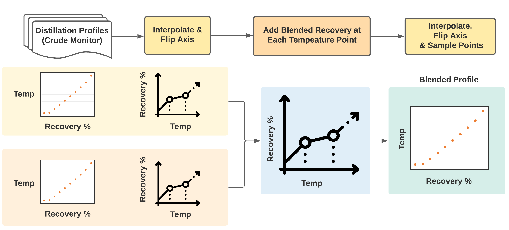

# Blended Distillation Profiler

## Overview

The goal is to generate an approximate distillation profile for a blend of two types of oil based on volume share.

A distillation profile is a discrete snapshot of temperatures at which X% of the oil has evaporated.

## Model Approach

The approach taken was to interpolate data values for each distillation profile, allowing us to then, for every temperature point, compute the blended mass recovery %. We can then use these aggregations to build out the blended mixture's final distillation profile.



## Assumptions

1. The individual distillation profile for each oil does not change when mixed. Such that there is no chemical reaction that causes the profile to change. This allows us to add up the mass recovery rate for both oils in a blend (based on percent share) at each temperature point.

2. That a "Piecewise Cubic Hermite Interpolating Polynomial" interpolant using monotonic cubic splines to find the value of new points would be a good fit for estimating data values. This assumption was made based on the source code behind the "Interpolation Calculator" on the Crude Monitor website, which also uses this interpolant type.

3. Wherever a distillation profile has no values (typical at 95%, 99%), this means that no further evaporation occurs at higher temperatures. Such that after the peak temperature point in a profile, no further mass recovery occurs.

## Processing Steps

1. Download source code for the front page of Crude Monitor. Extract oil codes using "grep" search on source code and some text manipulation. Store to "data/oil-codes.csv".

2. Use oil codes to download the most recent distillation profile table for each oil code using Pandas' read_html function. Store to "data/oil-profiles.csv".

3. For each oil pair in the blend, interpolate in-between profile values and then flip axis, so mass recovery % values are mapped over its temperature range (min and max temperature in original profile).

4. Merge mass recovery % values for each oil onto the same DataFrame.

5. For every integer temperature point in the combined DataFrame, compute the blended mass recovery %.

```
# at each integer temperature point
blended_recovery = (oil1_recovery * oil1_blend_share) + (oil2_recovery * oil2_blend_share)
```

6. Generate blended distillation profile by interpolating the expected temperature points at each of the typical distillation profile percentage markers (i.e. 5, 10% ...).

7. Mark NaN for temperature points at mass recovery rates that are not obtainable for a blend.

## Testing

To test the model, two approaches were taken.

1. A generator testing framework (profile_generator_test.py) creates blended distillation profiles for every combination of valid oil code pairs and every percent blend variation (1 to 99%) for two oils. Data output from this step is stored to CSV files (blended-profiles-all-pairings.csv, blended-profiles-all-percentages.csv) which can then be analyzed as a sanity check.

2. A starter unit testing framework (profile_builder_test.py) was created which can be used to help perform regression testing whenever model changes occur.

## Installation

#### Create and enable virtual environment

```
python3 -m venv venv/
source venv/bin/activate
```

#### Install required dependencies

```
pip install -r requirements.txt
```

## Usage

Within virtual environment

#### Run using user input prompts

```
python profile_builder.py
```

#### Run unit tests for builder

```
python profile_builder_test.py
```

#### Run generation tests for all valid oil code pairings and blend percentage ranges

```
python profile_generator_test.py
```

## Example - User Input (profile_builder.py)

```
Blended Distillation Profile Builder...

Distillation profile available for following oil codes:
['AHS' 'AWB' 'BCL' 'BDY' 'BHB' 'BRN' 'BRS' 'CAL' 'CDB' 'CHV' 'CL' 'CNS'
 'CNX' 'F' 'FD' 'FRB' 'HSB' 'HSC' 'KDB' 'LCB' 'LLB' 'LLK' 'LSB' 'MBL'
 'MGS' 'MJT' 'MPR' 'MSB' 'MSE' 'MSM' 'MSW' 'MSW(S)' 'MSY' 'OSA' 'OSH' 'P'
 'PAS' 'PCH' 'PLS' 'PSC' 'PSH' 'PSY' 'PXB' 'RA' 'SC' 'SCS' 'SH' 'SHB'
 'SHD' 'SMA' 'SPR' 'SSP' 'SSX' 'SYB' 'SYN' 'WCB' 'WCS' 'WDB' 'WH']

Enter first valid oil code:
BCL

Enter second valid oil code:
PSH

Enter volume for the first oil code:
40

Enter volume for the second oil code:
60

Do you want to update distillation profiles from Crude Monitor? (Y/N)
N

Blended distillation profile for BCL (40.0%) and PSH (60.0%):
    recovery  temperature
0          5    91.824460
1         10   135.125648
2         20   203.269749
3         30   261.609511
4         40   313.868118
5         50   362.169638
6         60   412.359712
7         70   470.423815
8         80   556.228779
9         90          NaN
10        95          NaN
11        99          NaN
```
